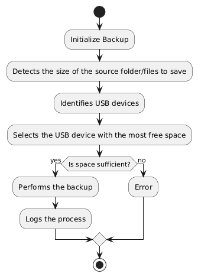
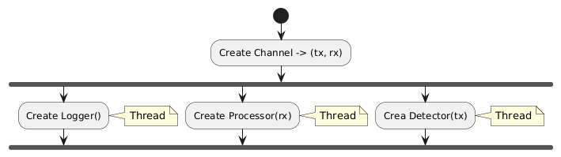

# Emergency Backup Application (Rust)

## Project Overview

This project aims to develop a Rust application for PCs that allows users to perform backups even when the screen is not operable. The application facilitates backups to an external drive (e.g., USB flash drive) using specific mouse commands. It is designed to run in the background with minimal CPU usage and is installed during the PC's bootstrap process.

## Application Structure

### Definitions
  - **Command 1**: Draw a rectangle along the screen edges.
  - **Command 2**: Trace a "-" on the screen.

### Background Activities

#### Detector(tx: Sender)
Detects mouse movements, identifies Command and sends signals for Command 1 or Command 2. 

#### Logger() 
Logs CPU usage every 2 minutes. 

### Command Processing
#### Processor(rx: Receiver)
Processes the command received and if the sequence is correct starts the backup procedure. 

### Backup Execution
#### Backup() 
Checks the files-to-save size and the available space in the USB devices detected. If possible, does the backup. 

### Main Process
In the **main()** function of our application happens the channel and threads initialization. 

## Installer
To deploy the application the user will have an installer composed like this:
1. **Setup Screen:**
   - Brief description of the application.
2. **Configuration Screen**
   - Configuration of backup type:
     - Choose root folder for the backup[Browse].
     - Select "Entire folder content" or "Specific file types".
3. **Install Screen**
    - Final installation process.

**Automatic Startup:** The installer will configure the program to run at system startup.

## Testing

### Module Tests

- **LoggerTest:** Ensures CPU usage is logged correctly.
- **ProcessorTest:** Validates proper handling of commands and initiation of the backup process.
- **DetectorTest:** Confirms accurate detection and differentiation of mouse movements for commands.
- **BackupTest:** Ensures the backup process executes correctly, handling different scenarios.

### Integration Tests

- **ApplicationTest:** Ensures all components work together, with correct backup execution and logging, as well as proper CPU usage recording during background execution.

## Usage

- **Initiating Backup:**
  - Draw a rectangle along the screen edges (Command 1).
  - Confirm with a "-" sign on the screen (Command 2).
- **Backup Activation:** Wait for the confirmation window and sound alert.
- **Backup Completion:** Wait for the confirmation window or size error window and sound alert.

## Logs and Performance

- **CPU Usage Log:** Recorded every 2 minutes in a log file.
- **Backup Log:** Created on the USB drive post-backup, detailing data size and CPU time.
